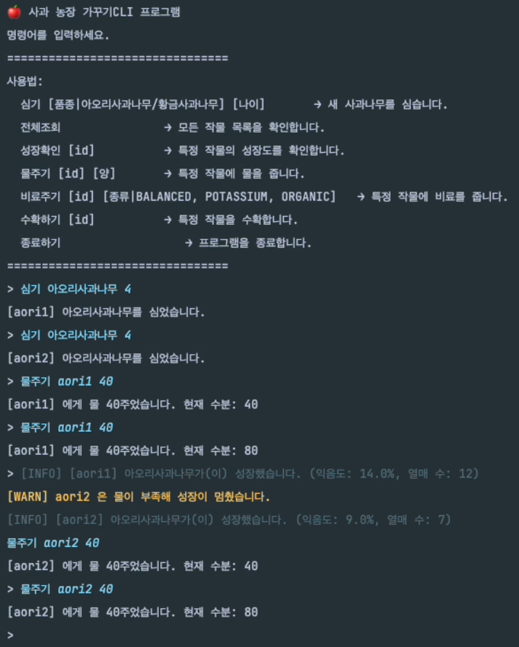
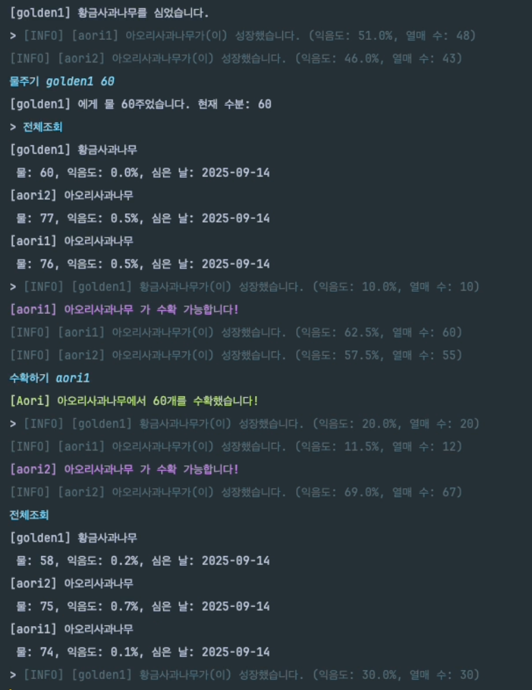
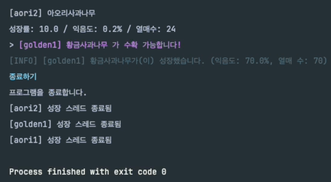

# 🍎 사과 농장 가꾸기 CLI

터미널에서 사과 나무를 심고, 물과 비료를 주고, 성장 과정을 확인하며 수확까지 할 수 있는 **CLI 시뮬레이션 프로그램**

멀티스레드를 이용해 시간이 흐름에 따라 자동 성장을 반영

---

## 주요 기능

- **나무 심기**: 원하는 품종(아오리사과 / 황금사과) 선택
- **성장 관리**: 물주기, 비료주기를 통해 성장 속도와 결과가 달라짐
- **자동 성장**: 스레드 기반으로 일정 시간이 지나면 하루씩 자동 성장
- **성장 확인**: 익음도, 열매 수, 물 상태 등을 확인할 수 있음
- **수확하기**: 일정 조건이 충족되면 수확하고 상태를 확인할 수 있음

## 실행 화면
### 나무 심기 & 물 주기
나무를 심은 후, 멀티스레드로 자동 성장 가능 \
물이 부족하여 성장이 멈췄음을 스레드가 알림

### 조회 & 수확
다른 품종 나무를  심을 수 있고, 시간이 흐름에 따라 다른 품종 나무가 성장하는 과정을 스레드를 통해 알 수 있음 \
전체 품종에 대한 조회가 가능하고, 열매가 20개 이상 열리고, 익음도가 80% 이상일 때 수확 가능하다는 것을 스레드를 통해 알림이 옴 \
(첨부 사진은 실험결과를 캡쳐하기 위해 열매 수확 조건을 임의로 조정한 것)

### 프로그램 종료
프로그램 종료와 함께 각 나무에 대한 스레드도 함께 종료
